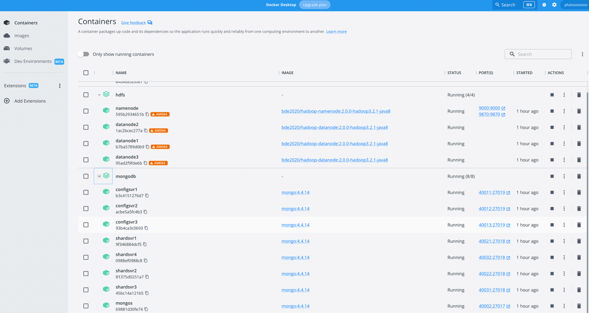
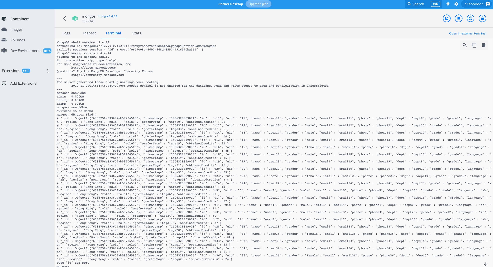
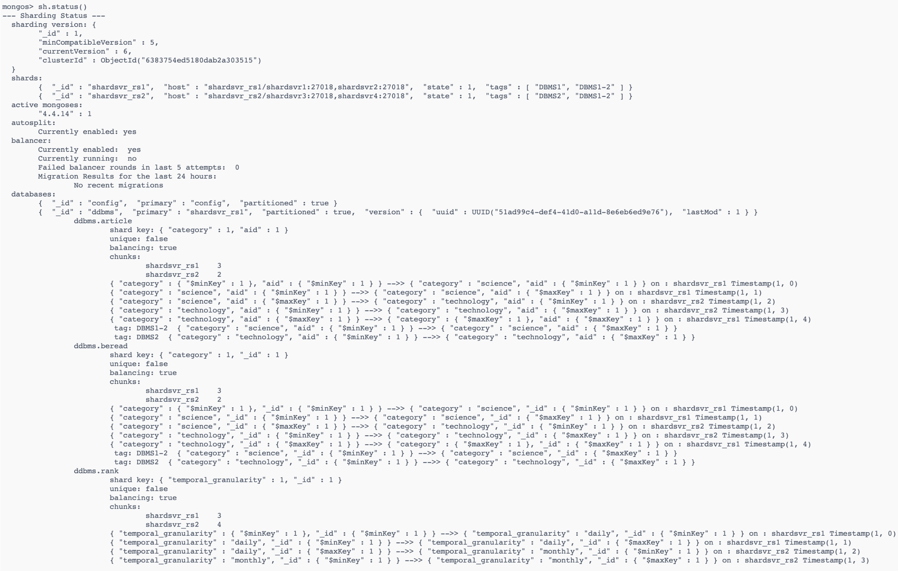
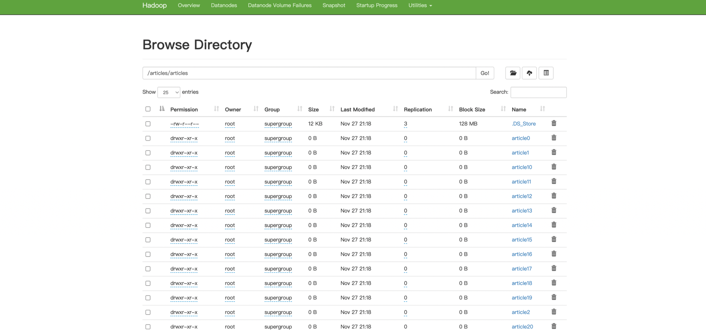

Manual

# 1. 环境准备
本项目需要完成如下的环境配置和数据准备

## 1.1. 本项目需要以下环境
- Docker
- Java 8
- nodejs
- npm
- Maven 
- [mongosh](https://www.mongodb.com/docs/mongodb-shell/install/)
- [MongoDB Database Tools](https://www.mongodb.com/docs/database-tools/installation/installation/)
- [Mongo Compass](https://www.mongodb.com/docs/compass/current/install/)
- [Studio 3T](https://studio3t.com/download/)
- [Prometheus 2.30.3](https://prometheus.io/download/)
- [Grafana 8.4.2](https://grafana.com/grafana/download)

## 1.2. 数据准备
- 将`db-generation`解压后放到`${PROJECT}/env`下
- 将`db-generation`重命名为`data`

# 2. 部署方法

## 2.1. 包结构
本项目的包结构如下
```
└── ${PROJECT}
    ├── frontend 前端代码
    ├── backend 后端代码
    └── env 脚本及配置文件
        ├── data 数据文件位置
        ├── grafana-dashboard Grafana 面板位置
        ├── hdfs HDFS配置文件
        ├── mongodb MongoDB配置文件
        └── scripts 脚本文件
```

## 2.2. 脚本介绍
- `/env/script`目录
  - `setup.sh`、`setup.bat`：初始化并启动容器，包括数据加载等，⽤于第⼀次启动
  - `shutdown.sh`、`shutdown.bat`：停⽌容器的运⾏，并删除容器
  - `start.sh`、`start.bat`：开始容器的运⾏（第⼀次启动请使⽤ setup.sh）
  - `stop.sh`、`stop.bat`：停⽌容器的运⾏

## 2.3. 部署流程

### 2.3.1. 数据生成

使用脚本：`/env/data-generate/genTable_mongoDB10G.py`

```sh
# 进入到相应目录，然后运行 genTable_mongoDB10G.py
python3 genTable_mongoDB10G.py
```

### 2.3.2. 初始化服务

首次启动：使用脚本`/script/setup.sh`

```sh
# 进入到 /script 目录，然后运行 setup.sh
./setup.sh
```

`setup.sh`脚本说明：

```sh
#!/bin/bash

# hdfs
docker-compose -f ../hdfs/docker-compose.yml up -d
sleep 10
# 创建目录，将 /data/articles/ 上传至 hdfs
docker exec -it namenode hadoop fs -mkdir /articles/
docker exec -it namenode hadoop fs -put /data/articles/ /articles/


# redis
docker pull redis:7.0.0
docker run -itd --name redis -p 6379:6379 redis
docker network connect hdfs_hadoopnet redis --ip 172.21.0.6


# mongodb
# config servers
docker-compose -f ../mongodb/docker-compose-configsvr.yml up -d
mongosh --host localhost --port 40011 ../mongodb/setup-configsvr.js
# shard servers
docker-compose -f ../mongodb/docker-compose-shardsvr.yml up -d
mongosh --host localhost --port 40021 ../mongodb/setup-shardsvr-rs1.js
mongosh --host localhost --port 40031 ../mongodb/setup-shardsvr-rs2.js
# mongos
docker-compose -f ../mongodb/docker-compose-mongos.yml up -d
sleep 5
mongosh --host localhost --port 40002 ../mongodb/setup-mongos.js
docker network connect hdfs_hadoopnet mongos --ip 172.21.0.7

# load data
# 使用 mongoimport 直接导入生成的数据
mongoimport --host localhost --port 40002 -d ddbms -c user --file ../data/user.dat
mongoimport --host localhost --port 40002 -d ddbms -c article --file ../data/article.dat
mongoimport --host localhost --port 40002 -d ddbms -c read --file ../data/read.dat
# 使用 js 脚本生成 be-read 和 rank 表
mongosh --host localhost --port 40002 ../mongodb/generate-beread.js
mongosh --host localhost --port 40002 ../mongodb/generate-rank.js
```

### 2.3.3. 启动前端
进入`/frontend`文件夹，执行如下命令本地编译：

```sh
npm install
```

执行如下命令启动前端

```sh
npm run dev
```

然后可以在localhost:8080访问到前端

### 2.3.4. 查看监控
> 以 MacOS 为例

#### 2.3.4.1. Prometheus
1. 下载Prometheus的二进制包到本地，解压后进入对应文件夹：

```sh
tar xvfz prometheus-*.tar.gz
cd prometheus-*
```

2. 修改Prometheus的配置文件prometheus.yml文件如下：

```yml
global:
  scrape_interval: 15s

scrape_configs:
  - job_name: "prometheus"
    static_configs:
    - targets: ["localhost:9090"]
  - job_name: "dbms"
    static_configs:
    - targets: ["localhost:8088"]
```

3. 启动 Prometheus:

```sh
./prometheus --config.file=prometheus.yml
```

4. 访问`http://localhost:9090`，进入Status下的Target界面查看联通情况


#### 2.3.4.2. Grafana
1. 下载Grafana的二进制包到本地，解压后进入对应文件夹：

```sh
tar -zxvf grafana-*.tar.gz
cd grafana-*
```

2. 启动Grafana

```sh
./bin/grafana-server web 
```

3. 访问`http://localhost:3000`，进入Grafana
4. 配置对应的Data Source为刚刚安装好的Prometheus的位置
5. 在Dashboard界面，Import面板的配置`/env/grafana-dashboard/DBMS Dashboard.json`，然后选择对应的job和instance后即可访问

## 2.4. 环境查看说明

### 2.4.1. Mongo

首先在 Docker Desktop 中 进入 mongos 容器：



#### 2.4.1.1. 查看数据
在 Terminal 中 运行如下命令可以查看导入的数据

```sh
# 进入 mongodb
mongo

# 查看 db
show dbs

# 使用 ddbms 并查询 user 表
use ddbms
db.user.find()
```



#### 2.4.1.2. 查看数据分片


### 2.4.2. Hadoop

访问 localhost:9870 可以看到数据成功导入
